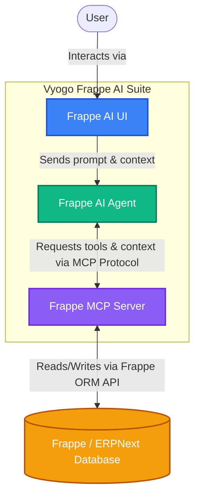

# Vyogo Frappe AI Suite

Welcome to the **Vyogo Frappe AI Suite** monorepo! This repository unifies the three core pillars of the Frappe AI ecosystem maintained by [VyogoTech](https://github.com/vyogotech). 

This suite brings advanced AI capabilities, agentic workflows, and Model Context Protocol (MCP) support to the Frappe Framework and ERPNext.

---

## Architecture Overview

Here is a high-level overview of how the components within the Frappe AI Suite interact with one another and your existing Frappe/ERPNext application:



The suite is broken down into three decoupled yet highly synergistic components, included here as Git Submodules:

### 1. [Frappe MCP Server](https://github.com/vyogotech/frappe-mcp-server)
**The Data & Capability Layer**
- Implements the [Model Context Protocol (MCP)](https://modelcontextprotocol.io).
- Exposes Frappe ORM, Document interactions, and Meta-data as standardized tools and resources to LLMs.
- Acts as the secure bridge between your Frappe data and any MCP-compatible AI client.

### 2. [Frappe AI Agent](https://github.com/vyogotech/frappe-ai-agent)
**The Orchestration & Reasoning Layer**
- The intelligent agent that orchestrates complex workflows within the Frappe ecosystem.
- Consumes the MCP server to read contexts, execute Frappe actions, and formulate structured plans.
- Capable of autonomous task execution tailored to Frappe/ERPNext business logic.

### 3. [Frappe AI UI](https://github.com/vyogotech/frappe_ai)
**The Interaction & Presentation Layer**
- A seamless conversational AI interface and sidebar integration.
- Plugs directly into your ERPNext/Frappe workspace to allow users to interact with the AI Agent and MCP server in real-time.
- Features intuitive chat UI, prompt templates, and seamless context awareness of the active Frappe page.

---

## Getting Started

### Prerequisites
- Node.js (v18+)
- Python 3.10+
- Frappe Framework v14/v15
- Git

### Cloning the Suite
When cloning this repository, ensure you pull the submodules:

```bash
git clone --recurse-submodules https://github.com/vyogotech/frappe-ai-suite.git
cd frappe-ai-suite
```

If you have already cloned it without submodules, run:
```bash
git submodule update --init --recursive
```

---

## Documentation
- [MCP Server Docs](https://github.com/vyogotech/frappe-mcp-server/blob/main/README.md)
- [AI Agent Docs](https://github.com/vyogotech/frappe-ai-agent/blob/main/README.md)
- [UI App Docs](https://github.com/vyogotech/frappe_ai/blob/main/README.md)

## Contributing
Please review the contribution guidelines in the respective submodule repositories. We follow standard Git Flow and Conventional Commits.

---
*Built by [VyogoTech](https://github.com/vyogotech)*
